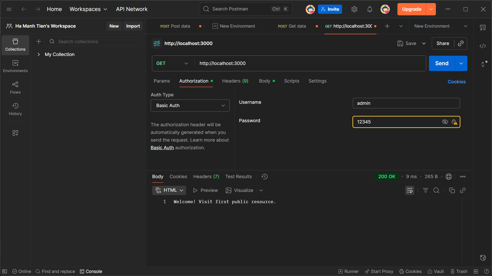
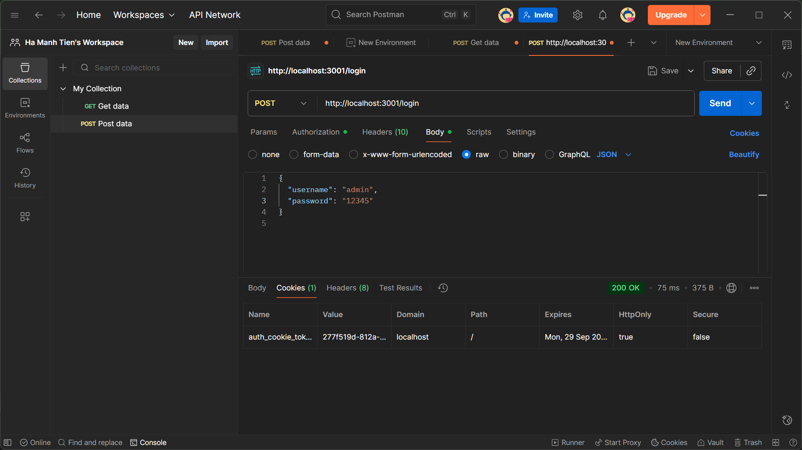
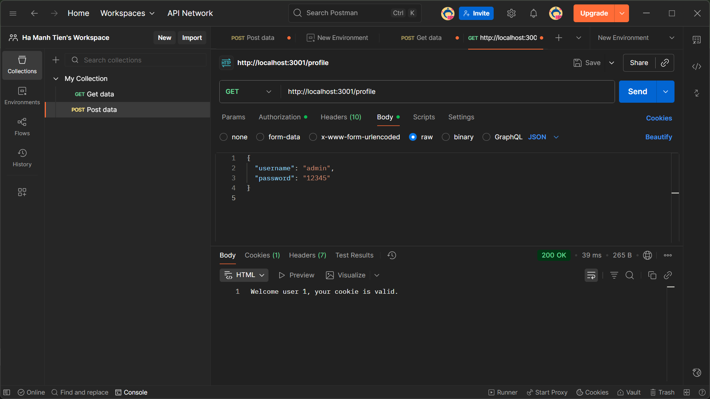
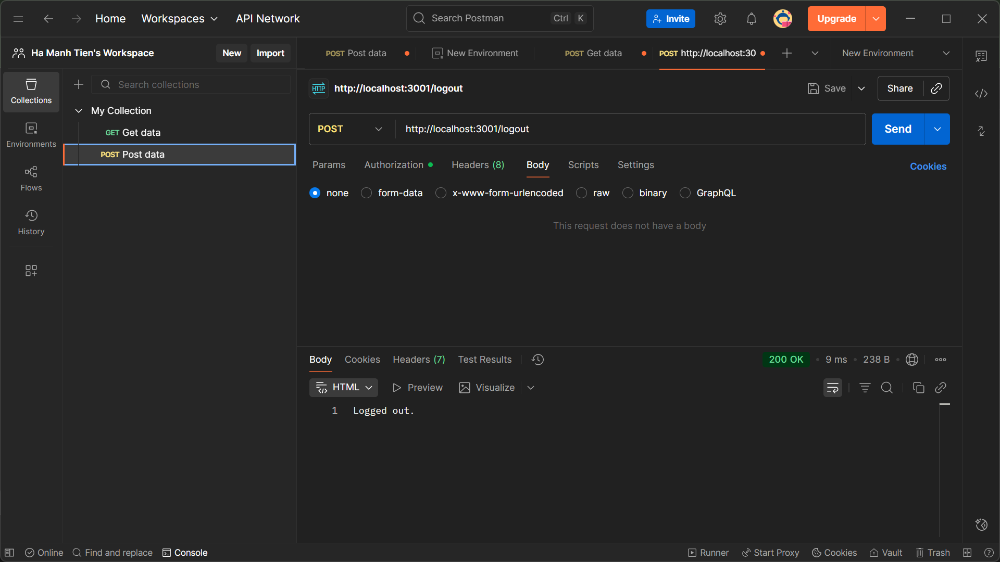
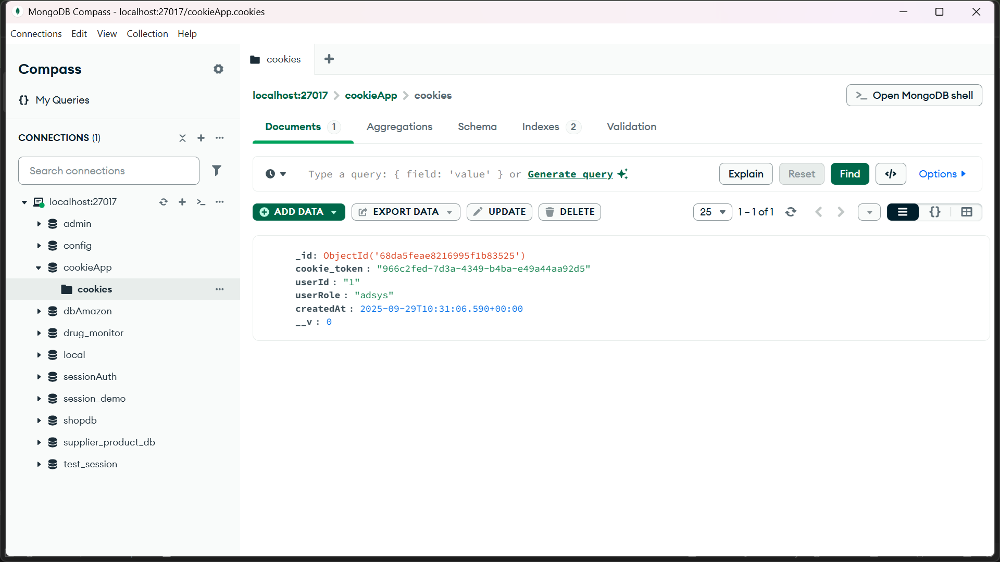

# Project: Simple Auth

## Thông tin sinh viên
- **MSSV:** 22711971  
- **Họ và tên:** Hà Mạnh Tiến
  
## 1. Basic Auth
- Chạy: `node basic_auth.js`
- Test: mở Postman, chọn Basic Auth → nhập user/pass → gửi request.

## 2. Cookie Auth
- Chạy: `node cookie_auth.js`
- Test login với Postman:
  - POST /login (username, password)
  - GET /profile (xem thông tin, cần cookie)
  - GET /logout (xóa cookie)

## 3. Kết quả
  
  
  
  

---
